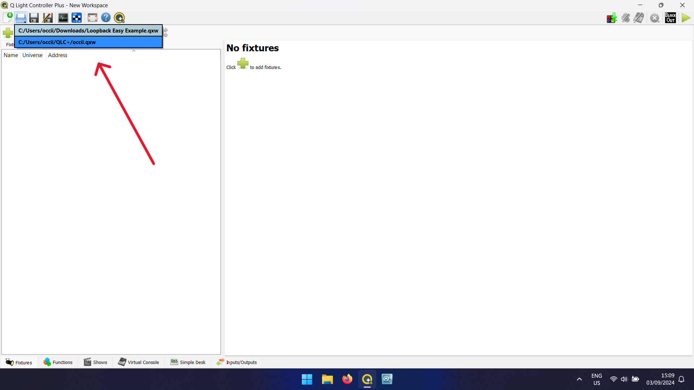

# Quick Start

To boot up the light system quickly:
1. Ensure everything is well connected:
    * The console is powered on and connected to the laptop;
    * The ENTTEC DMX Pro box is connected to the laptop and to the lights network;
    * The laptop is connected to the power.
2. Log into the OCCII lights computer.
3. Open QLC+ through the shortcut.

4. Load the `occii.qwx` settings file.

5. Select the **Virtual Console** tab underneath.

6. Switch QLC+ to **Operate Mode** on the top left.

While the room may still be dark, the console is now operational! The **Virtual Console** on-screen should match the layout of the physical console itself, so for quick reference use this to know which buttons run which functions.

To turn on the lights, select a color for the stage using these buttons:

And for the audience space, using one of these:

Finally, turn up the brightness for the different light groups using these sliders:

Also, make sure the master slider is turned up.

To turn on the merch light, use this button:

